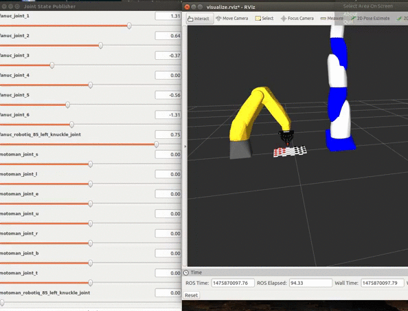

# Readme for Checkers Playing Robots in ROS
 
----

Michaloski, John L
Tuesday, March 28, 2017
CheckersReadme.docx

This document describes playing checkers using the Robot Operating System (ROS) as the robot control infrastructure.  Instead of using the ROS moveit package for motion control a combination of Gomotion trajectory generation based on robot kinematics described in URDF. The checkers demonstration is programmed using CRCL style commands that are programmed as C++ methods. Visualization is done using RVIZ (ROS Visualization) and [RVIZ makers](http://wiki.ros.org/rviz/DisplayTypes/Marker).
So far, besides using the core ROS tools, the following packages or code have been very useful:
 - David Lu arm_kinematics
 - Dave Coleman rvizvisualtools
 - Dave Hershberger, David Gossow, Josh Faust RVIZ

Checkers is useful in that it can demonstrate simple grasping using ROS. A Fanuc LR Mate 200 iD has a robotiq 2 finger gripper modeled in URDF in ROS and displayed in RVIZ. A simple bang-bang controller (no smooth trajectory motion) was initially used to move the checkers. Later the gomotion [gomotion](https://github.com/frederickproctor/gomotion) trajectory generation was extracted and mapped into a ROS  package that uses a tf  Pose, Quaternion and Vector as the main data structures.
Often the checker motions have a sloppy feel but it cuts down on the code size. Typically ROS moveit is used, but there are too many "moving parts" to easily integrate pick/place robotics.
Here is an animated gif of what is supposed to happen:

.


Autogenerated by [Word2Markdown](https://github.com/johnmichaloski/SoftwareGadgets/tree/master/Word2Markdown)